# Architecture

This solution follows the **Onion Architecture** pattern (also known as Clean Architecture), which provides:

- **Separation of Concerns**: Clear boundaries between business logic, data access, and presentation layers
- **Dependency Inversion**: Dependencies point inward toward the domain core
- **Testability**: Easy unit testing with minimal external dependencies
- **Maintainability**: Loosely coupled components that can evolve independently

## Layers

```mermaid
flowchart TD
    subgraph Presentation[🌐 Presentation Layer]
        direction TB
        WebAPIs[Web APIs]
        BlazorUI[Blazor UI]
        Agents["Agents
        (Background Services)"]
    end
    
    subgraph Infrastructure[🏗️ Infrastructure Layer]
        direction TB
        Logging
        Services
        Emails
    end
    subgraph Persistence[💾 Persistence Layer]
        direction TB
        SqlServer["SQL Server
        (EF Core)"]
        CosmosDB[Cosmos DB]
        Storage
    end
    subgraph Application[📋 Application Layer]
        direction TB
        BusinessLogic["Business Logic & Use Cases
        (Commands, Queries, Handlers)"        ]
    end
    subgraph Domain[🏛️ Domain Layer]
        direction TB
        DomainModels[Domain Models]
        Rules
    end
    
    %% Define the vertical flow between layers
    Presentation ~~~ Infrastructure
    Infrastructure ~~~ Persistence
    Persistence ~~~ Application
    Application ~~~ Domain

    %% CSS styling for uniform width
    classDef subgraphStyle width:100%
    class Presentation,Infrastructure,Persistence,Application,Domain, subgraphStyle
```



## Technology Stack

- **.NET 10**: Primary development framework
- **Entity Framework Core**: Object-relational mapping
- **Azure Functions**: Serverless compute platform
- **Blazor**: Client-side web UI framework
- **MediatR**: In-process messaging for CQRS implementation
- **Autofac**: Dependency injection container
- **Azure Cosmos DB**: NoSQL database for flexible data storage
- **SQL Server**: Relational database for structured data
- **Azure Storage**: Blob and queue storage
- **Application Insights**: Monitoring and telemetry

## Folder Structure

The solution is organized around key business domains:

### 📋 **Application Layer** (`src/Application/`)

### 🏛️ **Domain Layer** (`src/Domain/`)

### 🏗️ **Infrastructure Layer** (`src/Infrastructure/`)

### 💾 **Persistence Layer** (`src/Persistence/`)

### 🌐 **Presentation Layer** (`src/Presentation/`)

#### Background Agents (`src/Presentation/Agent`)

#### API Services (Azure Functions) (`src/Presentation/Api`)

#### API Clients (`src/Presentation/ApiClient`)

#### Desktop Apps (`src/Presentation/Desktop`)

#### Web Apps (`src/Presentation/Web`)

### Directory.Build.props

This solution heavily relies on ```Directory.Build.props``` in order to centralize certain key configurations.
One example is the dotnet version, which gets set at solution directory level instead of individually per project. If for whatever reason a project needs to deviate from this default, then it can and should be explicitely overwritten in the ```.csproj```.

However, this requires every folder between a project and the solution directory to have a ```Directory.Build.props```.
Here is a default template for a blank version:

```xml
<Project>
    <Import Project="$([MSBuild]::GetPathOfFileAbove('Directory.Build.props', '$(MSBuildThisFileDirectory)../'))" />
</Project>
```

There is a good guide written by NDepends about [Centralizing Dotnet Project Configuration](https://blog.ndepend.com/directory-build-props/)
